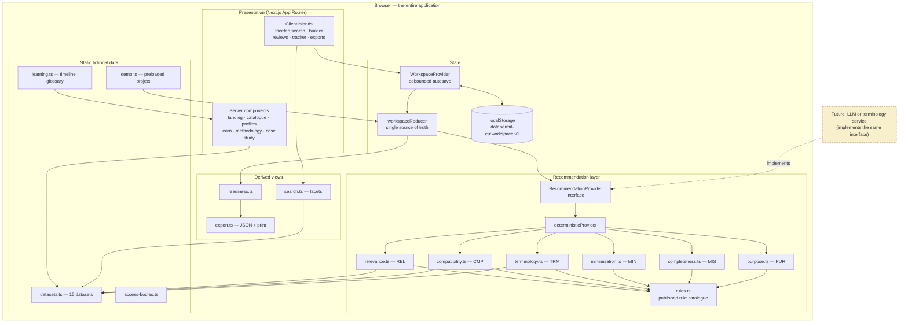

# DataPermit EU

**A research-data discovery and access-application workspace, inspired by the European Health Data Space.**

> ## ⚠️ This is an independent fictional prototype
>
> DataPermit EU is a **personal portfolio project**. It is **not** an official service of the
> European Commission, the European Health Data Space (EHDS), HealthData@EU, or any national
> Health Data Access Body. It is **not affiliated with, endorsed by, or connected to** any of
> them, and it does not use their branding.
>
> **Every dataset, data holder, access body, catalogue reference, requirement, quality score and
> approval outcome in this application is invented.** Nothing here describes a real catalogue or a
> real access process, and none of it should be used to plan an actual data-access application.
>
> The guidance the application produces is **educational only**. It contains **no legal
> conclusions** and gives no legal, ethical or regulatory advice. Any real research project must be
> confirmed with qualified legal advisers, a research ethics committee, and the competent
> data-access authority.
>
> The educational timeline and glossary describe the real, publicly documented EHDS at a high level
> and link to [official sources](#official-european-commission-sources). Everything else is fiction
> built to demonstrate a product design.

---

## What problem it explores

A researcher seeking secondary access to European health data has to work out which datasets
exist, whether any of them actually fit the question, which authority decides, what documentation
that authority wants, and how to ask for the least data that will still answer the question. None
of that is a research skill, and most of it is not written down in one place.

The result is that access correlates with network position rather than with the quality of the
question. The EHDS addresses much of this at the level of law and infrastructure. What it does not
do — and is not meant to do — is help an individual researcher reason through a specific
application. That gap is what this prototype explores.

DataPermit EU takes a researcher from a research question to a structured mock application, and
keeps the reasoning attached to the result.

## Features

### Discovery and assessment

- **Faceted catalogue** over 15 fictional datasets in 14 European countries, filtering by country,
  disease area, data category, population, time coverage, update frequency, coding system,
  access-body jurisdiction, approximate cohort size and three data-quality floors. Facet counts are
  computed against the results of *all other* facets, so a zero-count option is genuinely a dead end.
- **Dataset profiles** giving variables and field-level completeness, provenance, quality
  indicators, permitted and prohibited purposes, access conditions, known limitations, and whether
  linkage is even theoretically available. Limitations are given the same prominence as strengths.
- **Comparison workspace** with a pairwise compatibility view: linkage feasibility, shared coverage
  window, population overlap, terminology conflicts, and which holder's conditions end up governing
  the whole project.

### Application

- **Guided five-step builder** — purpose and public interest, scope and variables, analysis and
  linkage, documentation, duration and outputs — with debounced autosave to `localStorage`.
- **Per-variable request building**: a justification field sits next to every selected variable,
  with an explicit granularity choice (as published / coarsened / derived indicator).
- **Derived documentation checklist**, computed as the union of what every selected dataset requires,
  so adding a dataset surfaces its new obligations rather than hiding them.

### Review

- **Data-minimisation assistant** working per field: direct identifiers, missing justifications,
  available coarser forms, variables with no visible link to the stated purpose, over-broad requests,
  free-text fields, and duplicate concepts across datasets.
- **Readiness dashboard** scoring six sections on completeness and open findings, with an explicit
  statement that it measures form completion and is not a prediction of approval.
- **Mock reviewer view** with sectioned notes and outcome states.
- **Mock application tracker** showing pipeline state and which fictional access bodies would decide.
- **Exports**: structured JSON (application + audit trail) and a print-ready view for PDF, both
  carrying the independence disclaimer and every open finding — including dismissed ones.

### Education

- **EHDS timeline and glossary**, with every glossary entry labelled as either a real concept or an
  invention of this prototype.
- **Methodology page** publishing all 34 rules in full, each with its signal, its rationale and its
  documented weaknesses, plus the exact arithmetic behind all three scores.
- **Portfolio case study** covering the access problem, user journey, the role of minimisation,
  trust and explainability decisions, institutional stakeholders, prototype limitations, and what
  real EHDS interoperability would require.

## Screenshots

Screenshots are not committed to this repository. To capture them, run the app locally
(`npm run dev`) and visit:

| Page | Route | What it shows |
| --- | --- | --- |
| Landing | `/` | Independence disclaimer, workflow, worked example |
| Project dashboard | `/projects` | Projects with readiness meters and open-finding counts |
| Catalogue | `/catalogue` | Ten-facet search with live counts |
| Dataset profile | `/catalogue/scor-se` | Variables, provenance, quality, access conditions |
| Comparison | `/projects/demo-adherence-readmission/compare` | Pairwise compatibility, governing constraints |
| Application builder | `/projects/demo-adherence-readmission/application` | Five-step form with inline guidance |
| Minimisation review | `/projects/demo-adherence-readmission/minimisation` | Sensitivity profile and per-variable findings |
| Readiness | `/projects/demo-adherence-readmission/readiness` | Section scores, blocking findings, exports |
| Methodology | `/methodology` | The full published rule catalogue |

Place captures in `docs/screenshots/` and reference them here if you fork this project.

## The preloaded demo

**Medication adherence and cardiovascular readmission** — a worked example you can follow end to
end. Two Swedish registers hold the exposure (dispensing) and the outcome (readmission); a Finnish
repository was added as a possible replication cohort and turns out to raise problems.

The application is **deliberately imperfect**, so the review features have something real to say:

| Rule | What it catches |
| --- | --- |
| `MIN-01` | Exact date of birth requested where the holder publishes a birth-year default |
| `MIN-03` | Household income decile requested with no justification at all |
| `MIN-04` | Prescriber identifier that the analysis plan never mentions |
| `CMP-01` | Cross-border linkage between the Finnish and Swedish registers is not established |
| `CMP-02` | Two jurisdictions, two access bodies, two parallel processes |
| `TRM-01` | ICD-11 in Finland against ICD-10 in Sweden |
| `MIS-08` | No variables requested from the Finnish repository at all |

A demo where the assistant finds nothing would prove nothing.

## Local setup

Requires Node.js 20 or later.

```bash
git clone https://github.com/brigiari/datapermiteu.git
cd datapermiteu
npm install
npm run dev          # http://localhost:3000
```

### Scripts

| Command | Purpose |
| --- | --- |
| `npm run dev` | Development server |
| `npm run build` | Production build |
| `npm start` | Serve the production build |
| `npm run lint` | ESLint, zero warnings tolerated |
| `npm run typecheck` | TypeScript, no emit |
| `npm test` | Vitest suite |
| `npm run test:watch` | Vitest in watch mode |
| `npm run test:coverage` | Coverage report |
| `npm run verify` | Lint, typecheck and test together |

**No API keys, accounts or paid services are required.** The application has no backend, makes no
network requests, and stores everything in the browser's `localStorage`.

### Deployment

The app builds to a standard Next.js output and deploys unchanged to any Node host (Vercel,
Netlify, Render, Fly.io, a container):

```bash
npm run build && npm start
```

Because there is no server-side data store, a static export is also a valid target — add
`output: "export"` to `next.config.mjs` and serve `out/` from any static host. The project
pages are client-rendered from `localStorage`, so they work identically either way.

## Architecture



The seam that matters is `RecommendationProvider`. Every finding in the product flows through it,
and the interface **requires** a human-readable `reason` and an `evidence` array on every result. A
model-backed implementation that could not populate them honestly would fail to satisfy the type —
a small piece of governance encoded in a type signature.

See [`docs/ARCHITECTURE.md`](docs/ARCHITECTURE.md) for the full account.

## Data models

The fictional data models are documented in [`docs/DATA_MODEL.md`](docs/DATA_MODEL.md), with entity
relationship diagrams and field-level notes. In brief:

| Entity | Purpose |
| --- | --- |
| `Dataset` | A fictional catalogue entry: coverage, variables, quality, provenance, purposes, access conditions, linkage |
| `DatasetVariable` | One field, with an analytical category, a sensitivity band and an optional coarser default |
| `AccessBody` | A fictional national body that would decide on a request |
| `Project` | A research question, selected datasets, an application draft, an audit trail |
| `ApplicationDraft` | The five-step form, including per-variable requests and attestations |
| `Recommendation` | A finding, always carrying a reason, evidence and the rule that produced it |
| `AuditEntry` | An append-only record of one change |

## Testing and quality

```bash
npm run verify
```

227 tests across 11 files. Coverage concentrates on the recommendation rules and the store, because
that is where the product's claims live — a rule that fires when it should not is a worse failure
here than a layout bug.

- **Unit**: text utilities, faceted search, all six rule families, readiness scoring, exports, the
  workspace reducer, persistence and its corruption fallbacks.
- **Integration**: catalogue discovery (typing, faceting, chips, empty state, adding to a project),
  the application builder (step navigation, autosave round-trip through `localStorage`, variable
  toggling, documentation checklist), and the minimisation review (findings, dismissal, audit).
- **Component**: the recommendation card's disclosure behaviour, including that compact mode never
  hides the reason.

## Accessibility

Treated as a design constraint rather than a pass at the end. Highlights:

- One high-contrast focus treatment, applied globally and never removed.
- Skip link to main content; `<main>` is focusable as a landmark target.
- Meters carry explicit `role="meter"` with `aria-valuenow`/`min`/`max`, so a bar width is never the
  only way to read a value.
- Sortable tables announce state with `aria-sort`; every table has a caption.
- Result counts sit in `aria-live="polite"` regions.
- Collapsible facets and disclosures use `aria-expanded`/`aria-controls`.
- Colour is never the sole carrier of meaning — severity, sensitivity and status all have text labels.
- `prefers-reduced-motion` honoured globally.
- Wide tables scroll inside their own container; the page body never scrolls horizontally.

Full detail, including known gaps, in [`docs/ACCESSIBILITY.md`](docs/ACCESSIBILITY.md).

## Privacy, security and responsible use

- **No backend, no accounts, no analytics, no third-party requests.** Everything lives in this
  browser.
- **No real personal data**, and none should ever be entered — the demo content is entirely fictional.
- **No legal conclusions**: the product surfaces prompts for a person to consider, never decisions.
- **Every recommendation is dismissible**, and dismissals are written to the audit trail rather than
  quietly dropped.

See [`docs/PRIVACY_SECURITY.md`](docs/PRIVACY_SECURITY.md) and
[`docs/RESPONSIBLE_USE.md`](docs/RESPONSIBLE_USE.md).

## Roadmap

What would be required to move from design prototype toward real interoperability — machine-readable
dataset metadata, a terminology service, authentication and researcher accreditation, dataset and
permit APIs, secure processing environment integration, multilingual interfaces, and coordination
with national Health Data Access Bodies — is set out in [`docs/ROADMAP.md`](docs/ROADMAP.md).

## Official European Commission sources

For the real European Health Data Space, go to the source rather than to this prototype:

- [European Health Data Space — European Commission](https://health.ec.europa.eu/ehealth-digital-health-and-care/european-health-data-space_en)
- [EHDS Regulation — EUR-Lex](https://eur-lex.europa.eu/legal-content/EN/TXT/?uri=CELEX%3A32025R0327)
- [HealthData@EU pilot project](https://ehds2pilot.eu/)
- [European Data Protection Board](https://www.edpb.europa.eu/)
- [General Data Protection Regulation — EUR-Lex](https://eur-lex.europa.eu/eli/reg/2016/679/oj)

## Tech stack

Next.js 15 (App Router) · TypeScript (strict) · Tailwind CSS 3 · Vitest · React Testing Library ·
ESLint. No runtime dependencies beyond React and Next.

## Project structure

```
src/
├── app/                       # Routes (App Router)
│   ├── page.tsx               # Landing with the independence disclaimer
│   ├── catalogue/             # Faceted search and dataset profiles
│   ├── projects/[id]/         # Overview, compare, application, minimisation, readiness
│   ├── tracker/               # Mock application tracker
│   ├── learn/                 # EHDS timeline and glossary
│   ├── methodology/           # Published rule catalogue and limitations
│   └── case-study/            # Portfolio case study
├── components/                # Shared UI, forms, disclaimers
└── lib/
    ├── types.ts               # Domain model
    ├── data/                  # Fictional catalogue, demo project, educational content
    ├── recommendations/       # The rule engine, behind a provider interface
    ├── store/                 # Reducer, context, persistence
    ├── search.ts              # Faceted search
    ├── readiness.ts           # Readiness scoring
    └── export.ts              # JSON and print-ready exports
docs/                          # Architecture, data model, accessibility, privacy, roadmap
```

## Licence

[MIT](LICENSE). The fictional catalogue content is offered under the same terms — it describes
nothing real, and should not be presented as though it does.

---

*Built as a portfolio demonstration of full-stack engineering, information architecture, complex
form design, responsible AI practice, and privacy-aware healthcare research tooling.*
