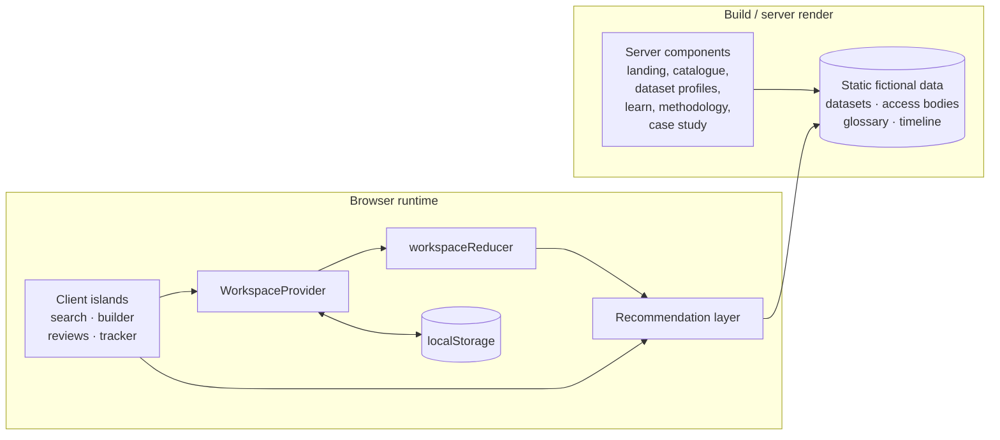
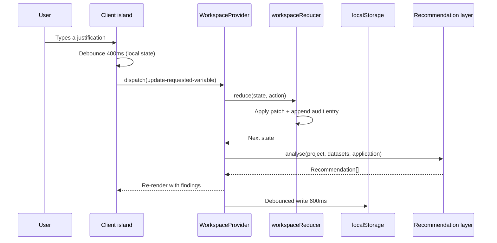
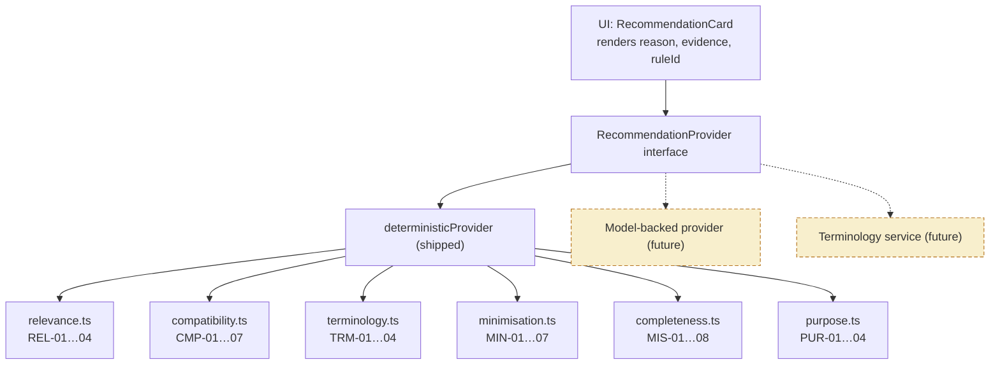
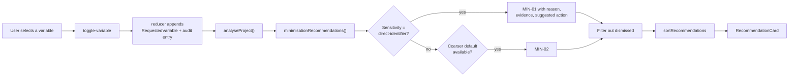

# Architecture

> **Reminder:** DataPermit EU is an independent fictional portfolio prototype. It is not affiliated
> with the European Commission, the EHDS, HealthData@EU or any national Health Data Access Body.
> All datasets, institutions and requirements described in the system are invented.

## Shape of the system

The whole application runs in the browser. There is no server-side data store, no API, no
authentication service and no third-party request at runtime. That is a deliberate choice for
something that models a privacy-sensitive workflow: a tool about data minimisation that quietly
shipped your draft application to a backend would be making an argument it did not intend.

### Server versus client

Static content — the landing page, the catalogue listing shell, every dataset profile, the
educational pages, the methodology catalogue and the case study — renders on the server and is
prerendered at build time. Anything that touches workspace state is a client island.

The dataset profile is the clearest example: the page itself is a static server component and
`generateStaticParams` prerenders all 15, while the "Add to project" control is a small client
component embedded in it. The content stays cacheable; only the interaction ships JavaScript.

## State

All workspace mutations flow through a single reducer over one `WorkspaceState` object.

### Why everything goes through the reducer

The audit trail is only trustworthy if it cannot drift from the thing it describes. Routing every
mutation through the reducer means an action that changes the application also writes its own log
entry in the same transition — there is no path that changes state without recording it, and no
opportunity for the two to disagree.

It also makes the trail record what the *system* did, not just the user. A recommendation that was
generated and then dismissed is part of the story of how an application was reached, so dismissals
are appended to the log rather than silently dropped.

### Two debounces, doing different jobs

- **Field-level (400 ms)**, inside `AutosaveTextarea` / `AutosaveInput`: keeps typing smooth by
  holding keystrokes in local state, and keeps the reducer — and therefore the recommendation engine
  — running at a sensible cadence instead of on every character. Blur commits immediately, so
  tabbing away never loses the last word.
- **Persistence-level (600 ms)**, inside `WorkspaceProvider`: collapses rapid state changes into a
  single `localStorage` write.

### Hydration

The provider renders the demo workspace on first paint so server and client markup match, then
replaces it from `localStorage` in an effect and sets `hydrated`. Components that would otherwise
flash demo content check `hydrated` and render a skeleton. `loadWorkspace` is defensive: a corrupt
entry, an unrecognised version or an unexpected role value all fall back to the demo workspace
rather than throwing.

## The recommendation layer

This is the part of the system with a deliberate architectural seam.

Every finding in the product is a `Recommendation`, and every `Recommendation` is produced through
`RecommendationProvider.analyse()`. The UI reads `reason`, `evidence` and `ruleId` without knowing
or caring how they were produced.

Two constraints are baked into the interface rather than into the current implementation:

1. **Every finding must carry a human-readable `reason` and a supporting `evidence` array.** A
   finding a user cannot interrogate must not be shown. Because both fields are required and
   non-optional on the type, an implementation that could not populate them honestly would fail to
   compile.
2. **No finding may be presented as a decision.** There is no `verdict`, no `approved`, no
   `compliant` field anywhere in the type. The shape offers `title`, `reason`, `suggestedAction` —
   and nothing that could be rendered as a ruling.

Swapping in a language model or a terminology service means implementing the interface and changing
one export in `src/lib/recommendations/index.ts`. No interface code changes.

### Why the shipped implementation is deliberately unclever

Hand-written rules over metadata and text: no model, no embeddings, no network call. The tradeoff is
accepted openly — the rules miss real matches and produce false ones, and the methodology page
publishes exactly where. What they buy is that a reviewer can read a rule and understand precisely
why a finding appeared, which for a governance tool is worth more than accuracy that cannot be
explained.

### Determinism as a contract

`sortRecommendations` orders by severity, then rule id, then finding id. `dedupeRecommendations`
keeps first occurrences. Finding ids are composed from rule id plus scope (`MIN-01:scor-se:scor-birthdate`),
so they are stable across runs — which is what makes dismissal work: a dismissed finding stays
dismissed, and the rest of the list does not reshuffle around it.

## Faceted search

`filterDatasets` applies every facet plus the free-text query synchronously against the in-memory
catalogue. Multiple values within one facet are OR; separate facets are AND.

`facetCounts` computes each facet's counts against the results of **all other** facets, excluding
the facet being counted. Without that exclusion, selecting "Sweden" would show every other country
at zero, which is both useless and misleading. With it, a zero genuinely means a dead end.

At 15 datasets a search index would be premature. `useDeferredValue` on the query is the concession
to input responsiveness; the pattern scales to a real index later without changing the call sites.

## Data flow for a finding

## Key module boundaries

| Module | Responsibility | Depends on |
| --- | --- | --- |
| `lib/types.ts` | Domain model and controlled vocabularies | nothing |
| `lib/data/*` | Static fictional content | `types` |
| `lib/text.ts` | Deterministic text helpers | nothing |
| `lib/search.ts` | Faceted filtering and scoring | `types`, `text` |
| `lib/recommendations/*` | Rule families behind a provider interface | `types`, `data`, `text` |
| `lib/readiness.ts` | Section scoring from findings and form state | `types`, `recommendations` |
| `lib/export.ts` | JSON and print payloads | `types`, `readiness`, `recommendations` |
| `lib/store/*` | Reducer, context, persistence | `types`, `data`, `recommendations` |
| `components/*` | Presentation | `lib/*` |
| `app/*` | Routes and page composition | `components`, `lib` |

Dependencies point one way. The recommendation layer never imports from `components` or `app`, which
is what lets it be tested as pure functions with no mocking.

## Testing strategy

Effort concentrates where the product's claims live. A rule that fires when it should not is worse
here than a layout bug, so the rule families carry the densest coverage.

- **Pure-function tests** for text, search, all six rule families, readiness and exports. No mocking
  needed, because none of these touch the DOM or the store.
- **Reducer tests** for every action, including immutability and the append-only guarantee on the
  audit trail, plus persistence round-trips and corruption fallbacks.
- **Integration tests** rendering real client islands inside a real `WorkspaceProvider`, exercising
  faceting, autosave through `localStorage`, and finding dismissal end to end.

Two product bugs were found by tests during development and fixed rather than papered over: an
ICD-10/ICD-11 revision mismatch being masked by a shared SNOMED CT declaration, and a stemmer that
turned `diagnoses` into `diagnos` so it never matched `diagnosis`.
