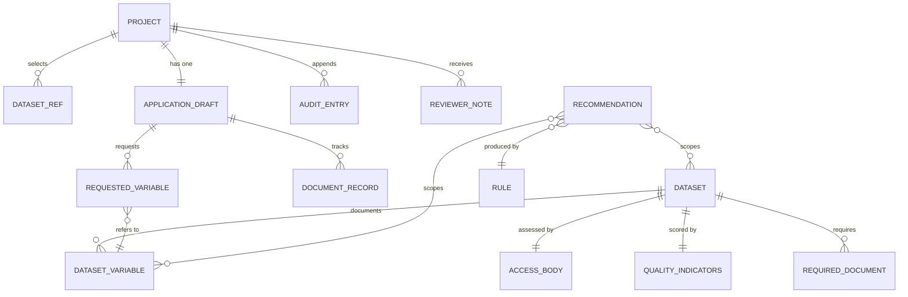

# Fictional data models

> **Every entity described here is invented.** The datasets, holders, access bodies, catalogue
> references, cohort sizes, quality scores, requirements and turnaround times exist only inside this
> prototype. They are internally consistent so the product behaves plausibly, but they describe
> nothing real. Do not use any of it to plan an actual data-access application.

## Entity relationships



## Catalogue entities

### `Dataset`

One fictional catalogue entry. The fields fall into four groups: what it contains, how good it is,
where it came from, and what it takes to get it.

| Field | Type | Notes |
| --- | --- | --- |
| `id` | `string` | Stable slug, e.g. `scor-se` |
| `name`, `acronym` | `string` | Invented register name |
| `holder` | `string` | Fictional organisation, always suffixed "(fictional)" |
| `country` | `Country` | One of 15 member states in the controlled vocabulary |
| `accessBody` | `AccessBody` | The fictional body that would decide |
| `summary` | `string` | One-paragraph description |
| `diseaseAreas` | `DiseaseArea[]` | Drives relevance rule REL-01 |
| `dataCategories` | `DataCategory[]` | Drives relevance rule REL-02 |
| `populations` | `Population[]` | Drives compatibility rule CMP-04 |
| `timeCoverage` | `{ start: number; end: number \| "ongoing" }` | Drives CMP-03 and MIS-05 |
| `updateFrequency` | `UpdateFrequency` | Drives CMP-05 |
| `codingSystems` | `CodingSystem[]` | Drives all TRM rules |
| `approximateCohortSize` | `number` | Facet only; fictional estimate |
| `accessComplexity` | `AccessComplexity` | Streamlined / Standard / Complex; adjusts REL-04 |
| `linkage` | `{ status; knownLinkedDatasets; notes }` | Drives CMP-01 and MIS-06 |
| `variables` | `DatasetVariable[]` | The field-level content |
| `quality` | `QualityIndicators` | Five 0–100 scores plus free-text notes |
| `provenance` | `{ collectionMethod; legalBasisSummary; curationProcess; lastAudited; versioning }` | Rendered on the profile's trust panel |
| `permittedPurposes` | `string[]` | Checked against the declared purpose category |
| `prohibitedPurposes` | `string[]` | Feeds PUR-01 |
| `accessConditions` | see below | Drives CMP-06, MIS-02, MIS-04 |
| `knownLimitations` | `string[]` | Given equal prominence to strengths on the profile |
| `catalogueRef`, `lastMetadataUpdate` | `string` | Fictional catalogue metadata |

**`accessConditions`**

| Field | Type | Notes |
| --- | --- | --- |
| `secureProcessingEnvironmentRequired` | `boolean` | Any `true` in a project makes it required overall |
| `outputChecking` | `string` | Prose description of the holder's process |
| `minimumAggregationThreshold` | `number` | 5 or 10; the **highest** governs a multi-dataset project |
| `requiredDocuments` | `RequiredDocumentId[]` | The **union** across a project drives the checklist |
| `feeBand` | enum | None → Cost recovery high |
| `maximumAccessMonths` | `number` | The **shortest** governs a multi-dataset project |

### `DatasetVariable`

The unit that data minimisation actually operates on.

| Field | Type | Notes |
| --- | --- | --- |
| `id`, `name`, `description` | `string` | |
| `category` | enum | `demographic`, `clinical`, `medication`, `laboratory`, `administrative`, `outcome`, `socioeconomic`, `geographic`, `temporal`, `identifier`. Matched against purpose text by MIN-04 |
| `sensitivity` | `low \| moderate \| high \| direct-identifier` | Drives MIN-01 and MIN-03 |
| `completeness` | `number` | 0–100, percentage of records populated |
| `codingSystem` | `CodingSystem?` | Present where the field is coded |
| `defaultGranularity` | `string?` | The coarser form the holder publishes by default. Drives MIN-02 |

`defaultGranularity` is the field that makes minimisation a spectrum rather than a binary. "Released
as birth year unless justified" turns "do you need date of birth?" into "how much of it do you need?",
which is usually the more productive conversation.

### `AccessBody`

| Field | Type | Notes |
| --- | --- | --- |
| `id`, `name` | `string` | 14 invented bodies, one per country represented |
| `country` | `Country` | |
| `jurisdiction` | `string` | Always marked "(fictional)" |
| `indicativeDecisionDays` | `number` | 25–90 working days; entirely invented |

### `QualityIndicators`

Five scores on 0–100 — `completeness`, `timeliness`, `interoperability`, `consistency`,
`documentation` — plus a `notes` array of free-text caveats. Real catalogues would derive comparable
indicators from a published data-quality framework; these are a simplified fictional illustration of
the idea.

The spread across a project drives CMP-07: a wide gap in `interoperability` means harmonisation
effort will concentrate on one source.

## Project entities

### `Project`

| Field | Type | Notes |
| --- | --- | --- |
| `id`, `title` | `string` | |
| `researchQuestion` | `string` | Structurally central — relevance, minimisation and purpose rules all read it |
| `principalInvestigator`, `institution` | `string` | |
| `createdAt`, `updatedAt` | ISO string | |
| `datasetIds` | `string[]` | Selection into the catalogue |
| `application` | `ApplicationDraft` | |
| `status` | `ApplicationStatus` | Mock only; set by the user |
| `submittedAt`, `mockReference` | optional | Stamped when status becomes `submitted` |
| `auditTrail` | `AuditEntry[]` | **Append-only** |
| `reviewerNotes` | `ReviewerNote[]` | From the mock reviewer role |
| `dismissedRecommendations` | `string[]` | Finding ids, not the findings themselves |

Storing dismissals as **ids** rather than as copies of the findings is what lets a dismissed finding
reappear if the underlying situation changes materially enough to produce a different id — and stay
dismissed when it does not.

### `ApplicationDraft`

Five groups matching the builder's steps.

| Step | Fields |
| --- | --- |
| Purpose | `researchPurpose`, `purposeCategory`, `publicInterestJustification` |
| Scope | `requestedVariables`, `populationDescription`, `timePeriod`, `estimatedCohortSize` |
| Method | `analysisPlan`, `statisticalMethods`, `linkageRequested`, `linkageJustification` |
| Governance | `documents`, `legalBasisNote`, `ethicsNote` |
| Outputs | `requestedAccessMonths`, `retentionPlan`, `expectedOutputs`, `outputDisclosureControls`, `dataDestructionPlan` |
| Attestations | four booleans, including an explicit acknowledgement that the guidance is educational |

### `RequestedVariable`

```ts
{
  datasetId: string;
  variableId: string;
  justification: string;                                   // per-variable, not per-form
  granularity: "as-published" | "coarsened" | "derived-indicator";
}
```

Three fields, and the design argument sits in the second and third. A single application-level
"why you need this data" box produces a paragraph of general reasoning; a justification attached to
each variable produces per-field argument, which is what makes minimisation assessable rather than
asserted.

### `DocumentRecord`

Ten document types (`ethics-approval`, `study-protocol`, `data-management-plan`, `dpia`,
`legal-basis-statement`, `institutional-authorisation`, `researcher-accreditation`,
`publication-plan`, `funding-declaration`, `conflict-of-interest`), each with a status
(`not-started` / `in-preparation` / `attached`), a reference and a note.

**No file is ever uploaded.** Marking a document "attached" records that you hold it. The prototype
has no server and stores nothing beyond the text you type.

### `AuditEntry`

```ts
{ id: string; timestamp: string; actor: "researcher" | "reviewer" | "system"; action: string; detail: string }
```

The `system` actor matters: recommendation generation and compatibility checks are logged alongside
user actions, so the trail records how an application was reached rather than only what it ended up
saying.

## The recommendation model

```ts
{
  id: string;                       // deterministic: ruleId + scope
  kind: RecommendationKind;         // one of six families
  severity: "info" | "advisory" | "attention";
  title: string;                    // the claim
  reason: string;                   // REQUIRED — why it was raised
  suggestedAction: string;          // never phrased as an instruction
  evidence: string[];               // REQUIRED — what it was based on
  ruleId: string;                   // resolves to the published catalogue
  scope: { datasetIds?; variableIds?; section? };
  source: "deterministic-rules";
  confidence: number;               // 0–1, displayed only as a qualitative band
}
```

Note what is **absent**: there is no `verdict`, no `compliant`, no `approved` and no `blocking`
field. The shape cannot express a decision, only a prompt — which is the point.

`confidence` is deliberately never rendered as a number. `confidenceBand()` maps it to Low /
Moderate / High, because a decimal in a governance interface reads as a promise.

## Controlled vocabularies

| Vocabulary | Values |
| --- | --- |
| `Country` | 15 member states |
| `DiseaseArea` | 8, from Cardiovascular to Multi-morbidity |
| `DataCategory` | 9, from hospital discharge records to biobank metadata |
| `Population` | 7 |
| `UpdateFrequency` | Continuous, Monthly, Quarterly, Annual, Irregular |
| `CodingSystem` | 9, including ICD-10, ICD-11, SNOMED CT, ATC, LOINC, ICPC-2, OMOP CDM v5.4 |
| `AccessComplexity` | Streamlined, Standard, Complex |
| `LinkageStatus` | 4, from a national pseudonymous key to no linkage support |
| `RequiredDocumentId` | 10 |
| `ApplicationStatus` | 6 |

All are `as const` arrays with derived union types, so adding a value is one edit and TypeScript
finds every place that needs updating.

## The catalogue at a glance

15 fictional datasets, chosen to span the requested clinical areas and to produce a realistic
distribution of quality and access difficulty.

| Acronym | Country | Focus | Interop | Access | Linkage |
| --- | --- | --- | --- | --- | --- |
| SCOR | Sweden | Cardiovascular registry | 88 | Standard | National key |
| SPDR | Sweden | Dispensing | 91 | Standard | National key |
| FINHER | Finland | Hospital discharge | 74 | Standard | Project-specific |
| DANDL | Denmark | Dispensing | 94 | Streamlined | National key |
| RROR | Germany | Oncology registry | 62 | Complex | Holder-internal only |
| ODSC | France | Diabetes cohort | 79 | Standard | Project-specific |
| LMHP | Italy | Mental health pathways | 55 | Complex | **None** |
| ILRE | Spain | Laboratory results | 96 | Standard | Project-specific |
| RPCC | Netherlands | Primary care | 83 | Standard | National key |
| BDHLR | Estonia | National longitudinal record | 97 | Streamlined | National key |
| VHDA | Poland | Legacy discharge archive | 38 | Complex | **None** |
| APROP | Portugal | Patient-reported outcomes | 64 | Standard | Project-specific |
| AMVS | Austria | Mortality and vital statistics | 72 | Standard | Project-specific |
| FBMD | Belgium | Biobank metadata directory | 61 | Complex | Project-specific |
| ECRF | Ireland | Cardiac rehabilitation follow-up | 76 | Standard | Project-specific |

The spread is intentional. BDHLR and DANDL are near-ideal; VHDA and LMHP are difficult in different
ways — one through legacy quality, the other through governance. A catalogue where everything was
usable would not exercise the compatibility or minimisation features at all.

## The demo project

`DEMO_PROJECT` in `src/lib/data/demo.ts` investigates medication adherence and cardiovascular
readmission across SCOR, SPDR and FINHER. It is written to be **plausibly good but deliberately
imperfect**, so the review features have real work to do:

| Deliberate flaw | Rule that catches it |
| --- | --- |
| Exact date of birth requested at full granularity | `MIN-01`, `MIN-02` |
| Household income decile with an empty justification | `MIN-03`, `MIN-04` |
| Full residential postcode justified as "May be useful" | `MIN-02`, `MIN-03` |
| Prescriber identifier justified as "Prescriber" | `MIN-01`, `MIN-03` |
| FINHER in the project with no variables requested | `MIS-08` |
| FINHER cross-border, no shared key | `CMP-01`, `CMP-02` |
| FINHER on ICD-11, SCOR on ICD-10 | `TRM-01` |
| Institutional authorisation and DPIA outstanding | `MIS-02` |

A second project, `DEMO_PROJECT_EARLY`, is deliberately thin so the dashboard shows contrast between
an application taking shape and one barely begun.
